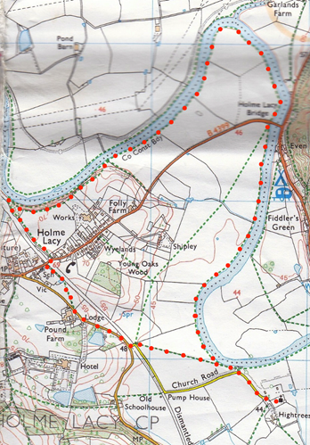

*Description.* An 8 km (5 mile) flat walk mostly along the river Wye. There are many stiles along this walk.
*Start* Park the car by the old railway bridge in Holme Lacy. Explorer Map 189 Grid 554357.
*Direction from Belmont roundabout* (Turn milometer to zero). Take the A49 to Ross-on-Wye and at 3 of a mile, (528 yds), TL at traffic lights and head towards Holme Lacy on the B4399. Continue straight on to reach Holme Lacy. As you go thru Holme Lacy, and just past the Primary School on your R, the road goes over a former railway line, (4.4 miles). Immediately over the former railway line, on the L hand side is a gap in the roadside big enough to park the car.

1. Holm Lacy. In the Doomsday Book, Holme Lacy was recorded as Hamme which was an estate of the Bishop of Hereford and held by Roger de Lacy, which is where the "Lacy" affix comes from. In 1354 substantial estates in the west of England were granted by William the Conqueror to Walter de Lacy, including the lands of Hamme, and just along the road is Holme Lacy House, a magical Grade 1-listed mansion where King Charles I rested his still-intact head in 1645. The mansion is now a hotel. Walk a few paces further along the L hand side of the road to reach the first house, and a footpath signpost. TL, (the house is now on your R), and a little further on you go thru a metal gate into F1. Walk along the L hand edge of this field, above the railway cutting, and when you reach the field end you will see the River Wye directly in front of you. Continue to follow the field edge as it bends around to the R, the river is now way down there on your L.

2. The River Wye. Keep the river on your L. Proceed on thru a small gate and stile into F2. Walk on thru a small field and over a stile into F3. At the end of the next field you cross over a stile into F4. At the field end you cross over a stile and continue straight on thru a wooded area to reach its edge, where you cross over another stile by a metal gate into F5. Continue walking along the river bank (the river is on your L): and go over a stile into F6. The next stile you cross over is by a small hut, which is used by fishermen, (it looks more like a portable toilet), you are now in F7. Continue along the riverbank for about 1 km, (passing the Confluence of the river Wye & Lugg), crossing a stile into F8. Continue on to the end of the field to climb some concrete steps to reach the B4399 Holme Lacy road, on the L is Holme Lacy Bridge that crosses the river Wye.

3. Holme Lacy Bridge. Cross the road with care. Go down concrete steps, follow path to stile and cross over into F9. Continue by the river for about 1½ km and go thru F10, then its over three wooden plank bridge and thru a kissing gate into F11 to pass a small tin hut on wheels (R). Continue along the river and as you reach the end of this field, (with St Cuthbert's tower in view), bend R, to go thru a small metal swinging gate in the corner of the field and onto a road.

4. Church Lane. TL and walk up the lane to the Church of St Cuthbert, Holme Lacy. St Cuthberts, Holme Lacy church is largely 13th and 14th century work, with the addition of a 16th century north transept and south porch. There is a solid 14th century tower, rising in three stages at the west end of the church. The original village of Holme Lacy lay much closer to the church but was moved when Holme Lacy House was rebuilt in the 17th century.

5. St Cuthbert Church. When ready retrace your steps to the start of 4 and go back thru the small swinging gate and into F11. This time bear L over this very large field and head diagonally across it to the far corner. If you are heading in the R direction (Westerly) you will pass about midway between two poles, and then between two lone trees in the field to get to the corner. Once at the corner, go thru a small swinging gate and out onto the road where you TR. Follow the road around to the R as you head towards Hereford. Continue along this road and about 80 meters past Wilsley House, which is on your L, you TR and go thru a small metal swinging gate and into F12. Walk Half L and at the end of the field you go thru a small wooden gate into what at the moment is a building site. TR, and follow the fence(R) down to the bottom where you TL. You go thru a k-gate and walk along an enclosed grassing path, (a fence is on your L and trees are on your R). At the end of the path is the Holme Lacy road, which goes over the old railway bridge. TR and walk a few paces along the road to meet up with your motor that’s parked on the opposite side. Holme Lacy railway opened in 1855 and was located on the Great Western Railway line linking Ross-on-Wye and Hereford. Under the Beeching plan the station was closed in 1964, the platform remains but the station building has been demolished. 
